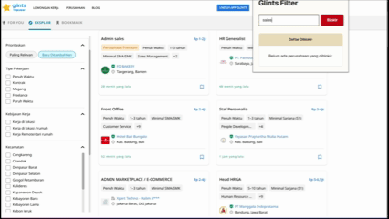

# Glints Filter

> A lightweight Chrome extension that lets you hide unwanted job listings on Glints using customizable keywords.
[](LICENSE)
[](https://www.google.com/chrome/)

Glints Filter is a browser extension designed to make browsing job listings on [Glints](https://glints.com/) more focused by automatically hiding job listings that match user-defined keywords.

For example, users can block keywords such as:

* `Sales`
* `Telemarketing`
* `Outsourcing`
* Specific company names
* Other unwanted job-related keywords

The extension filters matching listings before they are rendered whenever possible, while also providing a DOM-based fallback for listings that bypass the initial filter.

---

## ✨ Features

* **Keyword-based filtering**
  Block job listings by company name, position, or other keywords.

* **API-level filtering**
  Intercepts relevant response data before matching listings are rendered on the page.

* **DOM fallback**
  Automatically scans rendered job cards and hides listings that were not caught during the initial filtering stage.

* **Real-time updates**
  Newly added keywords are applied to the currently open Glints page without requiring a full page refresh.

* **Persistent preferences**
  Blocked keywords are stored using Chrome's local extension storage.

* **Lightweight**
  No external backend or database is required.

---

## 🧠 How It Works

The extension uses two filtering layers:

```text
                    ┌─────────────────────┐
                    │    Glints Website   │
                    └──────────┬──────────┘
                               │
                               ▼
                    ┌─────────────────────┐
                    │   Response/Data     │
                    │     Interception    │
                    └──────────┬──────────┘
                               │
                     Keyword matches?
                         /           \
                       Yes            No
                        │              │
                        ▼              ▼
                 Filter listing    Render page
                                       │
                                       ▼
                              ┌─────────────────┐
                              │   DOM Fallback  │
                              └────────┬────────┘
                                       │
                              Keyword matches?
                                  /        \
                                Yes         No
                                 │           │
                                 ▼           ▼
                              Hide        Keep
```

### Filtering layers

**1. Data interception**

The extension attempts to filter matching listings before they are rendered by the page.

**2. DOM fallback**

Because website behavior and page rendering can change, the extension also observes the DOM and checks newly rendered job cards.

This provides a second layer of filtering when listings bypass the initial interception process.

---

## 📦 Installation

Currently, Glints Filter can be installed manually as an unpacked Chrome extension.

### 1. Clone the repository

```bash
git clone https://github.com/sevou17/glints-filter.git
```

Or download the repository as a ZIP file.

### 2. Open Chrome Extensions

Navigate to:

```text
chrome://extensions/
```

### 3. Enable Developer Mode

Turn on **Developer mode** in the top-right corner.

### 4. Load the extension

Click:

**Load unpacked**

Then select the `glints-filter` project directory.

### 5. Open Glints

Visit:

```text
https://glints.com/
```

The extension should now be available from the browser extension menu.

---

## 🚀 Usage

1. Open Glints.
2. Click the **Glints Filter** extension icon.
3. Enter a keyword you want to block.
4. Add the keyword to your blocked list.
5. Matching job listings will be hidden automatically.
6. Remove a keyword from the list if you no longer want to block it.

### Example

If you add:

```text
Sales
```

job listings containing the matching keyword can be hidden automatically.

---

## ⚠️ Limitations

The filtering system currently performs text-based matching against job listing content.

Because of this, avoid using keywords that are too short or too generic.

For example:

```text
IT
PT
Data
```

may produce unintended matches depending on the content of a job listing.

A more specific keyword is recommended, such as:

```text
Telemarketing
Sales Executive
Nama Perusahaan
```

The extension also depends on the current structure and behavior of the Glints website. Changes to Glints' frontend, API behavior, or DOM structure may require updates to the extension.

---

## 🛠️ Tech Stack

* **JavaScript**
* **HTML**
* **Chrome Extensions API**
* **Chrome Storage API**
* **DOM / MutationObserver**
* **Fetch / response interception**

No backend service or external database is required.

---

## 📁 Project Structure

```text
glints-filter/
├── assets/
│   ├── screenshot.png
│   └── demo.gif
│
├── content.js       # Main content-side filtering logic
├── intercept.js     # Response/data interception
├── manifest.json    # Chrome extension configuration
├── popup.html       # Extension popup interface
├── popup.js         # Popup interaction and settings
│
├── .gitignore
├── LICENSE
└── README.md
```

---

## 🗺️ Roadmap

Possible future improvements:

* [ ] Separate company and job-title filters
* [ ] Support include/exclude rules
* [ ] Case-insensitive and configurable matching
* [ ] Regular expression support
* [ ] Import/export blocked keywords
* [ ] Better filtering controls
* [ ] Improved UI feedback
* [ ] Automated testing
* [ ] Chrome Web Store release

---

## 🔒 Privacy

Glints Filter is designed to operate locally in the browser.

Blocked keywords are stored using Chrome's local extension storage. The project does not require a separate backend server or user account.

---

## ⚖️ Disclaimer

Glints Filter is an independent third-party browser extension and is not affiliated with, endorsed by, or sponsored by Glints.

The extension may stop working if the Glints website changes its frontend implementation or data delivery mechanism.

---

## 📄 License

This project is licensed under the [MIT License](LICENSE).

---

## 👤 Author

Created by **sevou17**.

If you find a bug or have an idea for improvement, feel free to open an issue or submit a pull request.
